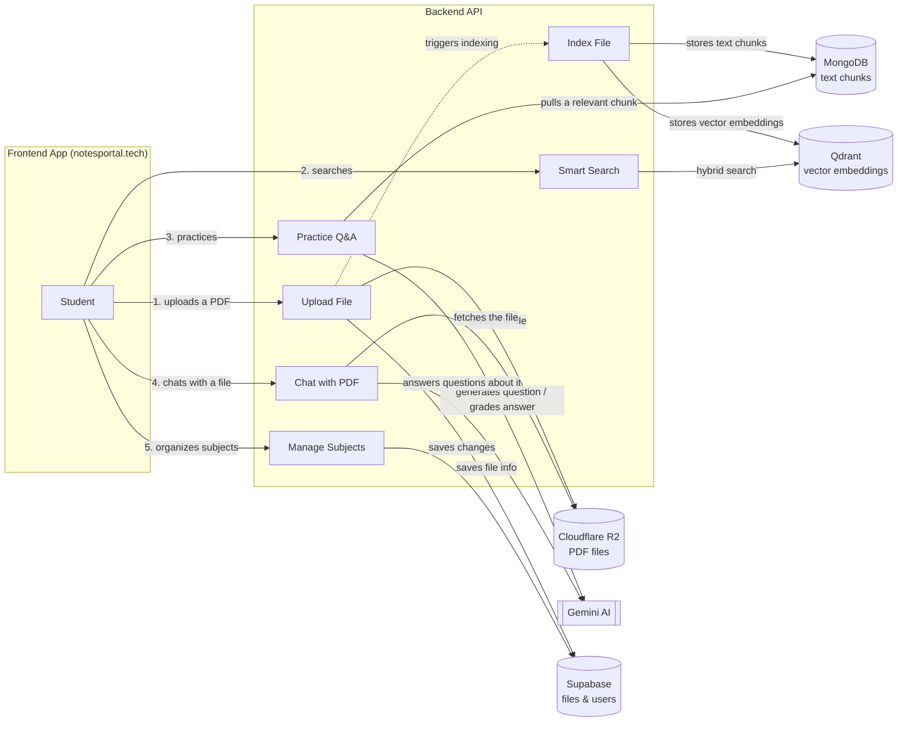

<h1 align="center">📘 notesportal</h1>

  <b>An AI-powered, collaborative note-sharing platform built by students, for students.</b> 
  Upload, organize, and search notes by subject — with AI helping you find and understand them faster.

  🔗 <a href="https://notesportal.tech" target="_blank"><b>Visit notesportal</b></a>

---

## 🎨 About

notesportal makes academic resources **accessible, organized, and collaborative**. Students upload their notes, and everyone else can browse, search, favorite, and download them — organized by subject.

On top of that, notesportal layers a few AI features (smart subject search, a QnA engine, and a "chat with PDF" tool) to help students get straight to the answer instead of digging through files.

---

## 🚀 Features

- 📂 **Upload File** – Upload a PDF, which is stored in Cloudflare R2 with its metadata saved to Supabase.
- 🔍 **Index File** – On upload, the file is automatically extracted, chunked, and embedded so it becomes searchable.
- 🔎 **Smart Search** – Hybrid (keyword + semantic) search across subjects to surface the most relevant files.
- ❓ **Practice Q&A** – Auto-generates questions from a file's content and grades your answers with AI.
- 💬 **Chat with PDF** – Conversational Q&A directly against a specific uploaded file.
- ⭐ **Favorites** – Save frequently used notes for quick access.
- 📚 **My Files & Subject Management** – Manage your own uploads and add, remove, or favorite subjects.
- 🔐 **Email OTP Auth** – Simple signup/login flow with one-time-password email verification.
- 🎨 **Dynamic Theming** – Switch between preset and custom accent colors, applied instantly and persisted across sessions.

---

## 🏗️ System Architecture

notesportal is split into a Next.js frontend and a backend API that handles indexing, search, and AI. Each feature flows into its own combination of storage and AI services:

- **Upload flow** – file bytes go to R2, metadata to Supabase, then indexing kicks off automatically.
- **Search flow** – Smart Search runs hybrid (keyword + semantic) lookups against Qdrant.
- **Practice flow** – a stored chunk is pulled from MongoDB and handed to Gemini to generate/grade Q&A.
- **Chat with PDF flow** – the source file is fetched from R2 and answered against by Gemini.
- **Subject management flow** – adding, removing, and favoriting subjects is saved straight to Supabase.

---

## 🛠️ Tech Stack

- **Frontend:** Next.js 15 (App Router), React 19, Tailwind CSS 4, Framer Motion
- **Auth:** JWT (`jose`) + email OTP via Nodemailer
- **Backend API:** Separate service handling upload indexing, search, and AI orchestration
- **File Storage:** Cloudflare R2 (S3-compatible, presigned uploads/downloads)
- **Database:** Supabase (files & user records), MongoDB (extracted text chunks)
- **Vector Search:** Qdrant (embeddings powering hybrid search)
- **AI:** Gemini (question generation, answer grading, PDF chat)
- **Analytics:** Vercel Analytics & Speed Insights

---

## 👥 Founders

**Arya Chawan · Arhaan Bhiwandkar · Bevin Johnson · Sharvil Gharkar**

---

## 🎯 Vision

To give students a **centralized, AI-assisted hub of academic resources** — making it easier to find, share, and actually learn from each other's notes.

---

  
  
  
  
  

